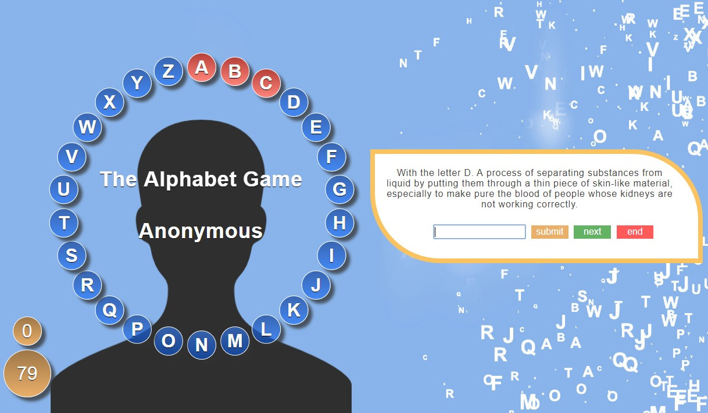

## THE ALPHABET GAME

<p align="center">
  
</p>

This game is a mix between the famous spanish game "Pasapalabra", broadcast on television for years, and the original british comedy panel game show The Alphabet Game.

### **Features**

- Just open the game, the letters wheel and the game rules appear.
- The game allows to be custumized with the user name and a masculine or feminine avatar.
- The game happens agains the clock, there are 150 seconds to end it.
- For every letter is proposed a question while the current letter is blinking in the wheel.
- If the answer is right, the letter become green and sounds a sucess audio. If not, it become red and sounds a failure audio.
- It's possible to jump a question to come back in the next round.
- The game can be canceled anytime.
- Once finished the game, it's possible to play again and check the score and ranking.
- All the puntuations are placed on a ranking, showing the 10 betters.

### **Setup**

If you’d like to view my project in your browser:

- Clone the repository in your computer, you can type the following command in your terminal
```bash
git clone https://github.com/diana-moreno/the-alphabet-game.git
```
- Open the-alphabet-game's folder.
- Open index.html
- Otherside, you can run the project here: https://diana-moreno.github.io/the-alphabet-game/


### **What I learned**

- Create layout with SASS and convert it to CSS.
- Arrange elements around a circle with a SCSS mixin.
- Implement fluid and responsive typography.
- Synchronize several effects with javascript and jQuery.
- Add audios with HTML and play them with JS.
- Set layout with absolute and relative positions.
- Take advantage of inputs radio to allow the user to customize the game.
- Keep the code organized and separated following the MVC (model, view, controller)


### **Resources**

- Designed by [freepik](https://www.freepik.com) and [freepng](https://www.freepng.com).
- Audios from [flukeout](https://flukeout.github.io/simple-sounds/) and [sonidosmp3gratis](https://www.sonidosmp3gratis.com)
